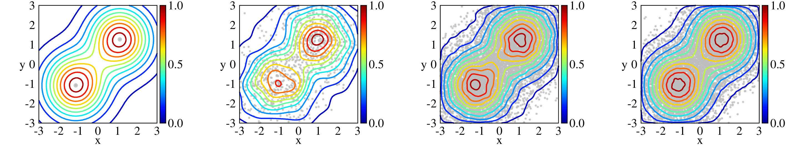
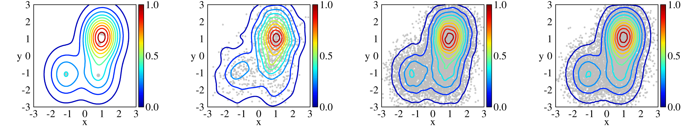
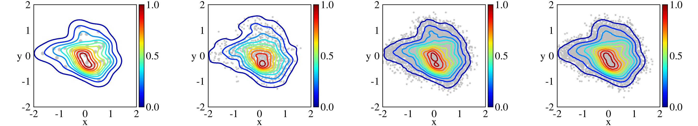

MVEQF
==========
Multivariate empirical continuous quantile function (grid-based). There are two approaches to quantile function evaluation depending on the type of sample storage. In the first case, the sample is presented in the explicit (real-valued) form and stored in the matrix. In the second case, the sample is presented in the implicit form and the trie-based structure. Here presented *header-based* library that allows you to perform quantile transforms based on given sample points. For more info and examples see: [poluyan.github.io/MVEQF](https://poluyan.github.io/MVEQF/)
### Installing
```sh
$ git clone https://github.com/poluyan/MVEQF
```
To perform quantile tranforms only header files from `src` are needed.
### Usage
Here is an example of two sample points and generated kernel density estimation with selected kernel type.
```cpp
#include <random>
#include <iostream>
#include <vector>

#include <mveqf.h>

int main()
{
  // 0 - Gaussian (default), 1 - Epanechnikov, 2 - Uniform, 
  // 3 - Biweight, 4 - Triweight, 5 - Laplacian
  size_t kernel_type = 0; 

  // 2 points example
  std::vector<std::vector<double>> sample = { {-1.13, -1.08}, {1.11, 1.27} };

  std::vector<double> lower_bound = {-3, -3};
  std::vector<double> upper_bound = {3, 3};

  mveqf::MVEQF<int, double> qf;
  qf.set_kernel_type(kernel_type);
  qf.set_sample_and_bounds(sample, lower_bound, upper_bound);

  // for generating points from [0,1]^n
  std::mt19937_64 generator;
  generator.seed(1);
  std::uniform_real_distribution<double> ureal01(0,1);

  for(size_t i = 0; i != 1000; i++) 
  {
    auto t = {ureal01(generator), ureal01(generator)};
    auto sampled = qf.transform(t);
    std::cout << std::scientific << sampled.front() << '\t' << sampled.back() << std::endl;
  }
}
```
To build this example specify a directory to search for include files and thread support library, e.g. for `g++`
```
$ g++ -std=c++17 -IMVEQF/src example.cc -pthread
```
The figure shows the result of the example above for different number of sampled points. The initial sample points, initial density estimation with Gaussian kernel, and 10^3, 10^5, 10^7 sampled points with corresponding kernel density estimation are presented.

```cpp
// 5 points example
std::vector<std::vector<double>> sample = 
{ {-1.13, -1.08}, {1.11, 1.27}, {0.86, 0.74}, {0.97, 1.31}, {0.79, -1.15} };
```

```cpp
// 50 points example
std::vector<std::vector<double>> sample = { 
{ -2.44e-01, 1.14e+00 }, { 5.24e-01, 9.54e-01 }, { 6.07e-02, 8.55e-01}, { -1.79e-01, 8.45e-01 }, { -1.79e-01, 5.75e-01 },
{ 4.25e-01, 5.47e-01 }, { 7.36e-01, 4.85e-01 }, { 7.17e-01, 3.85e-01 }, { 8.87e-02, 3.70e-01 }, { 5.40e-01, 3.45e-01 }, 
{ 5.86e-01, 3.20e-01 }, { -7.92e-01, 3.11e-01 }, { -1.22e+00, 2.83e-01 }, { -9.94e-01, 2.49e-01 }, { -4.87e-01, 2.08e-01 },
{ -5.43e-01, 2.02e-01 }, { -3.75e-01, 2.02e-01 }, { 4.00e-01, 1.62e-01 }, { -2.41e-01, 1.46e-01 }, { 1.10e-01, 1.40e-01 },
{ -1.26e-01, 1.06e-01 }, { -1.65e+00, 9.64e-02 }, { -2.82e-01, 9.01e-02 }, { 4.82e-02, 8.70e-02 }, { 1.04e-01, 4.35e-02 },
{ 1.09e-02, 1.55e-02 }, { -2.60e-01, -4.97e-02 }, { -1.10e+00, -7.46e-02 }, { 9.19e-01, -9.64e-02 }, { 1.20e-01, -1.80e-01 },
{ 6.98e-01, -1.87e-01 }, { 5.80e-01, -2.24e-01 }, { -1.85e-01, -2.30e-01 }, { 9.82e-01, -2.52e-01 }, { -4.18e-01, -2.74e-01 },
{ 7.00e-02, -2.77e-01 }, { -2.13e-01, -2.83e-01 }, { 3.87e-01, -2.83e-01 }, { 7.48e-01, -3.23e-01 }, { 2.72e-01, -3.76e-01 },
{ 1.01e-01, -4.26e-01 }, { -7.70e-01, -4.32e-01 }, { -4.20e-02, -4.32e-01 }, { -4.67e-03, -4.97e-01 }, { 1.04e-01, -5.22e-01 },
{ 1.94e-01, -5.35e-01 }, { 3.16e-01, -5.56e-01 }, { 5.24e-01, -5.63e-01 }, { 5.27e-01, -6.99e-01 }, { 5.40e-01, -9.33e-01 } };
std::vector<double> lower_bound = {-2, -2};
std::vector<double> upper_bound = {2, 2};
```

### License
The MVEQF is distributed under Apache License 2.0 and it is open-source software. Feel free to make a copy and modify the source code, but keep the copyright notice and license intact.
